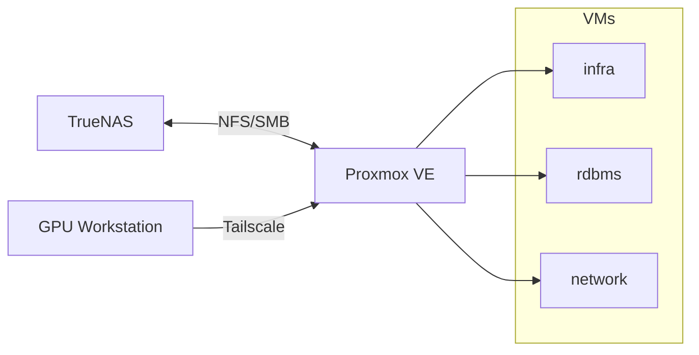
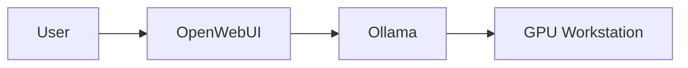
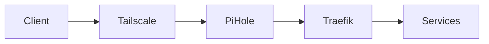
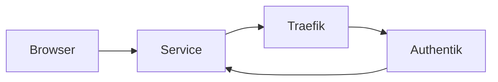
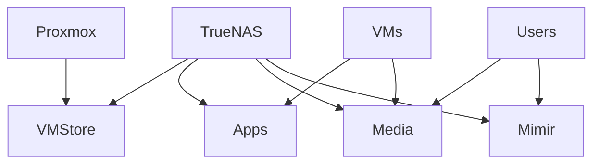
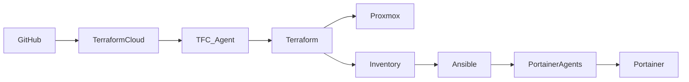

# 🏠 Homelab 2.0

[](https://developer.hashicorp.com/terraform)
[](https://www.ansible.com/)
[](https://www.portainer.io/)
[](https://goauthentik.io/)
[](https://traefik.io/)
[](https://tailscale.com/)
[](LICENSE)

> A reproducible, IaC-driven homelab built on Proxmox and TrueNAS, extended with a GPU workstation node for AI workloads.  
> Fully automated with Terraform + Ansible, secured with Authentik, and accessed through Tailscale.

---

## Table of Contents

- [Overview](#overview)
- [Architecture](#architecture)
- [Compute Nodes](#compute-nodes)
- [Network & Access](#network--access)
- [Authentication & SSO](#authentication--sso)
- [Storage](#storage)
- [Automation Pipeline](#automation-pipeline)
- [Tech Stack](#tech-stack)
- [Repository Structure](#repository-structure)
- [Roadmap](#roadmap)
- [Getting Started](#getting-started)

---

## Overview

This homelab focuses on:

- Reproducible infrastructure
- Separation of compute and storage
- Secure private access (no public exposure)
- Centralized authentication
- Hybrid compute (VM cluster + GPU workstation)

---

## Architecture



---

## Compute Nodes

### Proxmox Cluster

- Hosts all virtual machines
- Fully provisioned via Terraform
- Configured via Ansible

### GPU Workstation

- Connected via Tailscale
- Runs:
  - **OpenSSH** → remote execution (Jupyter, training, scripts)
  - **Ollama** → local LLM inference

Used for:
- model training / fine-tuning
- heavy compute workloads
- offloading AI tasks from the cluster

### AI Flow



---

## Network & Access

- All services are accessed through **Tailscale**
- **Pi-hole** handles DNS
- **Traefik** routes traffic internally



No services are exposed publicly.

---

## Authentication & SSO

Managed by **Authentik**

### Integrated Services

- Portainer → OIDC
- pgAdmin → OAuth2
- Proxmox → OIDC
- Traefik Dashboard → ForwardAuth



Features:
- OIDC / OAuth2
- Proxy authentication
- MFA
- Group-based access

---

## Storage

Storage is centralized on TrueNAS and split across two vdevs.

### Active Storage — `asgard`

| Dataset | Access | Purpose |
|--------|------|--------|
| vmstore | NFS | VM disks |
| apps/docker | NFS | App persistence |
| media | SMB + NFS | Shared + processed data |
| mimir | SMB only | User workspace |

### Backup Storage — `valhalla`

| Dataset | Purpose |
|--------|--------|
| backup | Backups |
| replicas | Replication |
| pbs | Future Proxmox Backup Server |

### Storage Flow



---

## Automation Pipeline



### Flow

1. Push to GitHub
2. Terraform provisions VMs
3. Ansible configures them
4. Portainer manages workloads

---

## Tech Stack

| Layer | Technology |
|------|-----------|
| Hypervisor | Proxmox VE |
| Storage | TrueNAS |
| IaC | Terraform |
| Config | Ansible |
| Containers | Portainer |
| Automation | Semaphore |
| Proxy | Traefik |
| DNS | Pi-hole |
| Identity | Authentik |
| VPN | Tailscale |
| Database | PostgreSQL |
| AI | Ollama + OpenWebUI |

---

## Repository Structure

```text
homelab-2.0/
├── terraform/
├── ansible/
├── docker/
├── scripts/
├── requirements.yml
└── .github/
```

---

## Roadmap

### Done
- Proxmox setup
- TrueNAS setup
- Terraform pipeline
- Ansible automation
- Authentik SSO
- Tailscale networking

### In Progress
- Authentik blueprints

### Next
- LDAP integration
- Monitoring stack
- AI VM (OpenWebUI)
- Proxmox Backup Server

---

## Getting Started

### 1. Terraform

```bash
cd terraform/proxmox
terraform init
terraform apply
```

### 2. Ansible

```bash
ansible-galaxy install -r requirements.yml
ansible-playbook -i inventory.yml deploy-portainer-agent.yml
```

---

## License

MIT