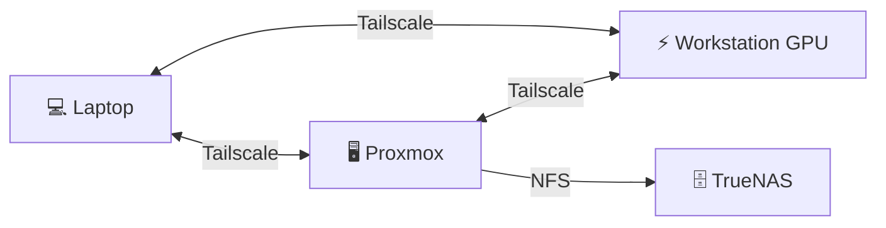
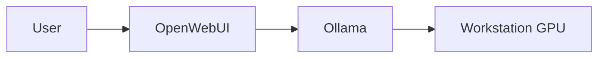
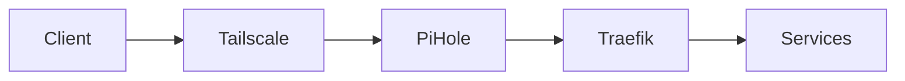
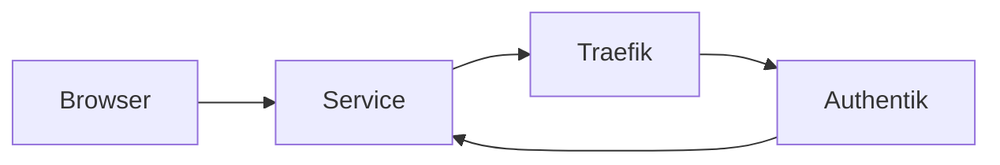
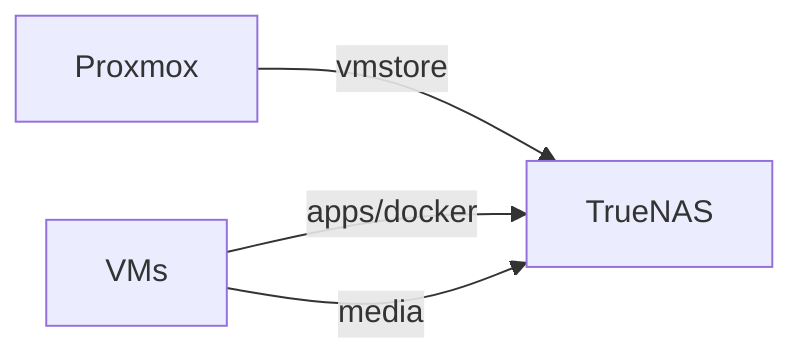
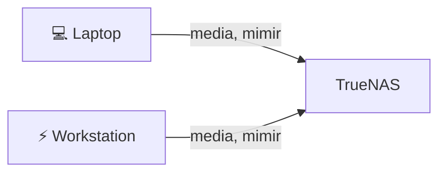
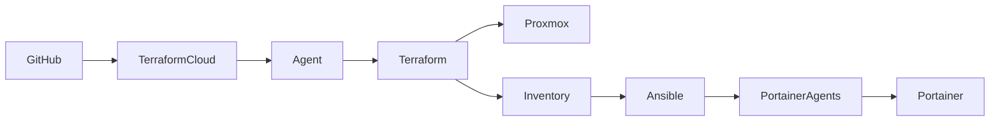

# 🏠 Homelab 2.0

[](https://developer.hashicorp.com/terraform)
[](https://www.ansible.com/)
[](https://www.portainer.io/)
[](https://goauthentik.io/)
[](https://traefik.io/)
[](https://tailscale.com/)
[](LICENSE)

> A reproducible, IaC-driven homelab built on Proxmox and TrueNAS, extended with a GPU workstation node for AI workloads.  
> Fully automated with Terraform + Ansible, secured with Authentik, and accessed through a private Tailscale mesh.

---

## Overview

This homelab is built around a few core ideas:

- Reproducible infrastructure (Terraform + Ansible)
- Separation of compute and storage
- Secure private access (no public exposure)
- Centralized authentication (SSO)
- Hybrid compute (VM cluster + GPU workstation)

---

## Architecture

### Physical Nodes

The system is composed of three independent machines:

- **TrueNAS** → storage node  
- **Proxmox** → virtualization / services  
- **Workstation PC** → GPU compute node  

All nodes (plus the laptop) are connected through Tailscale.

---

### Topology



---

## Compute Model

### Proxmox (VM Layer)

- Runs all infrastructure services
- Fully provisioned via Terraform
- Configured via Ansible

Main VMs:
- `infra` → Portainer, Authentik, Semaphore
- `rdbms` → PostgreSQL, pgAdmin
- `network` → Traefik, Pi-hole, Tailscale
- `home-assistant` → Home Assistant
- `tools` → SearXNG, OpenWebUI, Vaultwarden *(planned)*

---

### Workstation (GPU Node)

- Connected via Tailscale
- Runs:
  - **OpenSSH** → remote execution (Jupyter, training)
  - **Ollama** → LLM inference

Used for:
- model training / fine-tuning
- heavy compute workloads
- offloading AI tasks from Proxmox

---

### AI Flow



---

## Network & Access

- Private access only via Tailscale
- No public ports exposed
- Pi-hole handles DNS
- Traefik routes internal traffic
- SSL certificates and custom hostnames for TrueNAS and Proxmox



---

## Authentication & SSO

Managed by **Authentik**

### Integrated Services

- Portainer → OIDC
- pgAdmin → OAuth2
- Proxmox → OIDC
- Traefik → ForwardAuth
- Pi-hole → ForwardAuth
- Home Assistant → Proxy Auth



Features:
- OIDC / OAuth2
- MFA
- Group-based access
- Proxy authentication

---

## Storage Layout

TrueNAS is the storage backbone of the homelab.

Storage is split across two vdevs:

- **`asgard`** → active workloads and shared data  
- **`valhalla`** → backup and recovery  

---

### `asgard` — Active Data

| Dataset | Protocol | Purpose |
|---|---|---|
| vmstore | NFS | VM disks |
| apps/docker | NFS | App persistence |
| media | SMB + NFS | Shared + processed data |
| mimir | SMB | User workspace |

#### Details

- **vmstore** → Proxmox datastore (VM disks)  
- **apps/docker** → persistent data for containers  
- **media** → shared between users and services  
- **mimir** → user-only storage (isolated from services)  

---

### `valhalla` — Backup Layer

| Dataset | Purpose |
|---|---|
| backup | General backups |
| replicas | Dataset replication |
| pbs | Future Proxmox Backup Server |

---

### Storage Access Model

Storage access is split by role:

- **NFS → infrastructure & services**
- **SMB → user access**

---

### NFS Architecture



---

### SMB Architecture



---

## Automation Pipeline



### Flow

1. Push to GitHub  
2. Terraform provisions VMs  
3. Ansible configures them  
4. Portainer deploys services  

---

## Tech Stack

| Layer | Technology |
|------|-----------|
| Hypervisor | Proxmox VE |
| Storage | TrueNAS |
| IaC | Terraform |
| Config | Ansible |
| Containers | Portainer |
| Automation | Semaphore |
| Proxy | Traefik |
| DNS | Pi-hole |
| Identity | Authentik |
| VPN | Tailscale |
| Database | PostgreSQL |
| AI | Ollama + OpenWebUI |
| Home Automation | Home Assistant |
| Search | SearXNG |
| Secrets | Vaultwarden |

---

## Repository Structure

```text
homelab-2.0/
├── terraform/        # Infrastructure provisioning (VMs, cloud-init)
├── ansible/          # Configuration management
├── docker/           # Application stacks (Portainer-managed)
├── scripts/          # Automation helpers
├── requirements.yml  # Ansible dependencies
└── .github/          # CI/CD and updates (Dependabot)
```

### Explanation

- **terraform/** → creates infrastructure  
- **ansible/** → configures machines  
- **docker/** → runs services  
- **scripts/** → automation glue  

---

## Roadmap

### Done
- Proxmox + TrueNAS setup
- Terraform provisioning
- Ansible automation
- Authentik SSO
- Tailscale mesh
- GPU workstation integration
- Pi-hole SSO (ForwardAuth)
- Proxmox SSO (OpenID)
- Home Assistant VM deployment
- Home Assistant SSO (Proxy Auth)
- SSL & hostnames for TrueNAS and Proxmox

### In Progress
- Tools VM deployment (SearXNG, OpenWebUI, Vaultwarden)
- Authentik blueprints

### Next
- LDAP integration
- Monitoring stack
- Proxmox Backup Server

---

## Getting Started

### Terraform

Before running `terraform apply`, provide the required Terraform variables. The simplest option is to copy `terraform.tfvars.example` to `terraform.tfvars` and fill in values such as your Proxmox API URL/token, SSH keys, VM template ID, and VM map. If you prefer, you can also pass variables via standard Terraform CLI flags or environment variables instead.

```bash
cd terraform/proxmox
cp terraform.tfvars.example terraform.tfvars
# edit terraform.tfvars and set the required values
terraform init
terraform apply
```

### Ansible

The inventory file is not checked in. After running `terraform apply`, generate `ansible/inventory.yml` using the provided template as a reference and the VM IPs from `terraform output`:

```bash
# View VM IPs from Terraform
cd terraform/proxmox
terraform output portainer_hosts

# Create the inventory file (use terraform/proxmox/inventory.tmpl as a reference)
cp terraform/proxmox/inventory.tmpl ansible/inventory.yml
# edit ansible/inventory.yml and set the ansible_host values to the VM IPs above
```

Then install dependencies and run the playbook:

```bash
ansible-galaxy install -r requirements.yml
ansible-playbook -i ansible/inventory.yml ansible/playbooks/deploy-portainer-agent.yml
```

---

## License

[MIT](LICENSE)